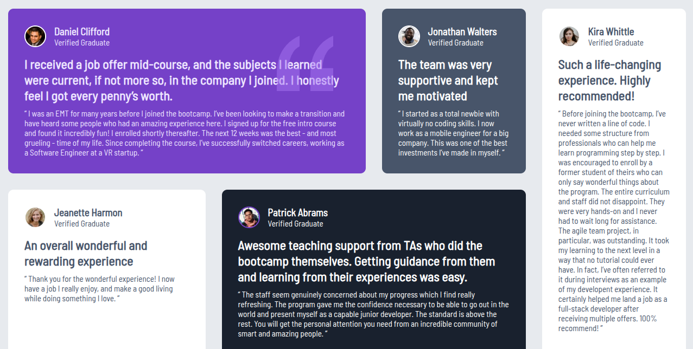

#  Testimonials Grid Section Solution

This is my solution to the [Testimonials Grid Section challenge on Frontend Mentor](https://www.frontendmentor.io/challenges/testimonials-grid-section-Nnw6J7Un7). Frontend Mentor challenges help you improve your coding skills by building realistic, portfolio-ready projects.

---

## Table of Contents

- [Overview](#overview)
  - [The Challenge](#the-challenge)
  - [Screenshot](#screenshot)
  - [Links](#links)
- [My Process](#my-process)
  - [Built With](#built-with)
  - [What I Learned](#what-i-learned)
  - [Continued Development](#continued-development)
  - [Useful Resources](#useful-resources)
- [Author](#author)
- [Acknowledgments](#acknowledgments)

---

## Overview

### The Challenge

Users should be able to:

- View the optimal layout for the site depending on their device's screen size
- Enjoy a responsive, clean testimonials layout
- Appreciate subtle design effects like background quote SVGs and custom grid positioning

---

### Screenshot



> A visual of the final responsive design, styled using CSS Grid, Flexbox, and mobile-first techniques.

---

### Links

- **Solution URL**: [View on Github(https://www.frontendmentor.io/solutions/responsive-testimonials-grid-using-css-grid-and-flexbox-XXXX)
- **Live Site URL**: [Live Demo](https://yourusername.github.io/testimonials-grid-section/)

---

## My Process

### Built With

- Semantic HTML5 markup
- CSS Custom Properties (Variables)
- **Flexbox** for mobile layout
- **CSS Grid** for complex desktop grid layout
- Mobile-first responsive workflow
- Vanilla CSS (no frameworks)
- Accessibility-first approach

---

### What I Learned

This project helped me level up in writing **mobile-first CSS** and using **CSS Grid layout** for complex responsive designs. I also learned how to:

```css
/* Use grid area and auto-rows for flexible card layout */
.container {
    display: grid;
    grid-template-columns: repeat(13, 1fr);
    grid-auto-rows: minmax(150px, auto);
    gap: 30px;
}
```

## Continued Development

In future projects, I’d like to:

- Refactor layouts with **SCSS** to improve maintainability
- Add **AOS (Animate On Scroll)** for subtle entrance animations
- Practice using `clamp()` and **fluid typography** for scalable text

---

## Useful Resources

- [CSS Grid by MDN](https://developer.mozilla.org/en-US/docs/Web/CSS/CSS_Grid_Layout) – The best docs to really understand grid.
- [CSS Tricks Grid Guide](https://css-tricks.com/snippets/css/complete-guide-grid/) – A cheat sheet I still use today.
- [Frontend Mentor Community](https://discord.gg/frontendmentor) – Gave me the right mindset and helped me debug layout issues.

---

## Author

- Github – [Michael-Okorie](https://github.com/Michael-Okorie)
- Frontend Mentor – [@Michael-Okorie](https://www.frontendmentor.io/profile/Michael-Okorie)
- Twitter – [@Dev_Michael_](https://x.com/Dev_Michael_)

---

## Acknowledgments

Huge thanks to the **Frontend Mentor** community for offering such clean, real-world design challenges.  
Special shout out to [@KevinPowell](https://www.youtube.com/kepowob) for his CSS teachings 

